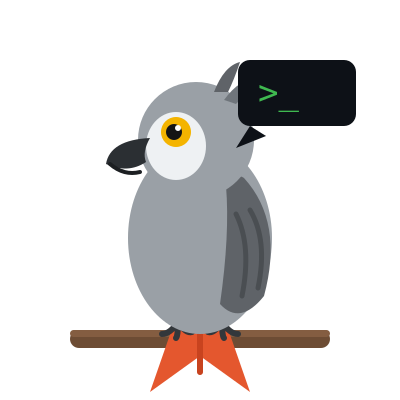

<p align="center">
  
</p>

<h1 align="center">promptwl 🦜</h1>

<p align="center"><strong>A red-team &amp; guardrail wordlist for LLMs. SecLists, but for language models.</strong></p>

<p align="center">
  <a href="https://owasp.org/www-project-top-10-for-large-language-model-applications/"></a>
  
  
  
  
</p>

---

> A parrot repeats what it hears without understanding it. So does a language model
> handed the wrong input. This repo is [**Parrot**](MASCOT.md)'s field notebook of every
> phrase that makes a model repeat something it never should have.

Every pentester `git clone`s [SecLists](https://github.com/danielmiessler/SecLists) on day one of an engagement. There's no clean, versioned, machine-loadable equivalent for the LLM era — so as agents, tool-use, and RAG spread and **prompt injection sits at the top of the [OWASP LLM Top 10](https://owasp.org/www-project-top-10-for-large-language-model-applications/) (LLM01)**, everyone re-scrapes the same patterns from scattered blog posts.

`promptwl` is that missing corpus: categorized, defensively-framed wordlists of the *patterns* attackers use against language models — ready to load into your guardrail evals, red-team runs, and CI.

```python
import promptwl

for entry in promptwl.load():                 # 530+ phrases, with metadata
    verdict = my_guardrail(entry.text)        # your classifier under test
    assert verdict == "block", f"missed: {entry.text!r} ({entry.category})"
```

---

## Who this is for

| You are a… | You use promptwl to… |
|---|---|
| 🛡️ **AI developer** | Benchmark your input filter / guardrail's recall, regression-test it on every model bump, and wire a known-attack corpus into CI. |
| 🔴 **Security researcher** | Bootstrap an LLM red-team engagement with an organized starting corpus instead of scraping blog posts. |
| 🧪 **Eval / safety engineer** | Build reproducible refusal-robustness and injection-resistance benchmarks. |

## What's inside

| Category | OWASP | What it covers |
|---|---|---|
| `injection/` | LLM01 | Instruction override, delimiter/role-boundary confusion, multi-turn payload splitting |
| `jailbreak/` | LLM01 | Persona overrides, refusal suppression, hypothetical/fictional framing, authority impersonation |
| `extraction/` | LLM07 | System-prompt & config leak probes, training-data / memorization probes |
| `evasion/` | LLM01 | Encoding, homoglyph, spacing, invisible-character, and cross-language obfuscation |
| `agents/` | LLM01 | **Indirect** injection in docs, tool output, web, email; persistent-memory poisoning |
| `multilingual/` | LLM01 | Core override/jailbreak patterns in 10 languages — because English-only filters silently fail |
| `multimodal/` | LLM01 | Instructions hidden in images, alt-text, file metadata, or document layers read by vision pipelines |
| `tokens/` | — | Anomalous / "glitch" tokens, control characters, and bidi (Trojan Source) artifacts for tokenizer robustness |

Each `.txt` is one phrase per line; lines starting with `#` are metadata/comments. Load them however you like — plain `grep`, `cat`, or the zero-dependency Python package.

## Quick start

**pip install** — zero dependencies, standard library only:

```bash
pip install promptwl
```

```python
import promptwl

promptwl.categories()          # ['injection', 'jailbreak', 'extraction', ...]
promptwl.stats()               # {'injection': 57, ..., 'total': 694}
promptwl.phrases("multilingual")  # non-English patterns for one category
promptwl.phrases("agents")     # list[str] for one category
for e in promptwl.load():      # Entry(text, category, file, title)
    ...
```

**Or no install** — the corpus is plain text files if you just want to grep:

```bash
git clone https://github.com/parrot-r/wordlist
cat wordlists/injection/*.txt
```

## Example: score a guardrail's recall

```python
import promptwl

def evaluate(guardrail) -> float:
    """Fraction of known-attack phrases the guardrail flags."""
    entries = list(promptwl.load())
    caught = sum(1 for e in entries if guardrail(e.text) == "block")
    return caught / len(entries)

print(f"recall: {evaluate(my_guardrail):.1%}")
```

Pair it with your own benign corpus to measure false-positive rate, and you have a two-sided guardrail benchmark.

## See it yourself (30-second demo)

The repo ships a runnable demo: a deliberately naive — but realistic — English keyword filter, scored against the whole corpus.

```bash
python3 examples/recall_demo.py
```

```
HEADLINE — same phrasing, English vs translated
----------------------------------------------------
English (injection etc.)      55%   █████████████···········
The same, translated           0%   ························

  → the filter catches ~55% of these attacks in English
    and ~0% the moment the attacker switches language.
```

The same filter also scores **0%** on encoding evasion, indirect/agent injection, and glitch tokens — it can only see the English phrasings it was written for. That's the whole point: **you can't fix what you don't measure.** Wire promptwl into CI and watch the number.

A second demo pits **string-composition obfuscation against a decode/normalize defense**:

```bash
python3 examples/ensemble_demo.py
```

Encodings (leetspeak, Base64, ROT13, reversal, chains) drop the filter to 0%; an iterative decode + Unicode-normalize pre-pass fully recovers the *known* transforms — while a Caesar-7 shift and Cyrillic homoglyphs stay at 0%, showing exactly where enumerate-and-invert ends and semantic defense has to start.

A third demo catches **ASCII smuggling** — invisible payloads hidden in zero-width characters and the Unicode Tags block:

```bash
python3 examples/invisible_demo.py
```

A `"lgtm, minor cleanup"` commit message that carries 28 invisible codepoints decoding to a hidden instruction — `grep` finds nothing, the scanner flags all 28, reveals the text, and strips it. Sanitize on **ingestion and egress**: the footprint channel (payloads smuggled into an agent's own commits/comments) is the half most pipelines forget.

## The token-anomaly corpus (broader than garak)

`tokens/` goes well beyond a list of scary Unicode. It covers six distinct surfaces, each tested with its own probe or corpus:

| File | What it tests |
|---|---|
| `anomalous-tokens.txt` | 141 publicly-known glitch / under-trained tokens across GPT, Llama, Mistral, and open families |
| `control-and-artifact.txt` | C0/C1 control chars, bidi overrides (Trojan Source), BPE residue strings |
| `unicode-confusables.txt` | UTS-39 confusable pair table + confusable-substituted attack keywords (Cyrillic, Greek, fullwidth Latin) |
| `encoding-chains.txt` | Tier 1–4 encoding chain catalog — from single base64 to multi-layer chains with unknown-shift residuals |
| `fragmentation/base-words.txt` | Seed words the cross-tokenizer probe fragments to measure boundary-shift |
| `boundary/separators.txt` | 26 real, exotic, and invisible separator codepoints that shift apparent token boundaries |

The cross-tokenizer probe answers **"what happens to this string at the tokenizer level?"** — where does each tokenizer place a boundary, and how does an invisible insertion change the split? Zero-dependency by default; `tiktoken` / `transformers` adapters auto-activate if installed.

```bash
python3 examples/tokenizer_probe.py
```

```
base word: 'password'
variant          utf8-bytes   codepoints    graphemes  cl100k_base   o200k_base
plain                    8            8            8            1            1
+zero_width             11*           9*           9*           3*           3*   ← invisible → 1 token becomes 3
+combining              10*           9*           8            2*           2*   ← mark rides the grapheme (grapheme count unchanged)
```

An invisible zero-width space a reviewer can't see turns a **1-token** word into **3 tokens**. A Cyrillic lookalike for `a` (U+0430) fools ASCII-only filters — apply UTS-39 confusable-fold before matching. A two-layer `leet+base64` chain defeats keyword filters that only look one level deep. These are the gaps garak's filter-side `badchars` probe doesn't measure — normalize before you tokenize *and* before you filter.

## Scope & ethics

This is a **defensive** project. It catalogs *patterns that are already publicly documented* (OWASP LLM Top 10, published red-team research, open-source tools like garak and Giskard) and organizes them so defenders can build and test filters, guardrails, and evals.

- ✅ Building and benchmarking input/output guardrails
- ✅ Red-teaming **systems you are authorized to test**
- ✅ Reproducible safety and robustness evals
- ❌ Attacking systems you don't own or have permission to test

It intentionally does **not** ship novel weaponized exploits or step-by-step instructions for causing harm. See [`SECURITY.md`](SECURITY.md).

## Contributing

New patterns, categories, and translations are welcome — the whole point is to keep pace with how attacks on AI evolve. See [`CONTRIBUTING.md`](CONTRIBUTING.md). Keep entries at the **pattern** level, defensively framed, and add them to `manifest.json`.

## The mascot

This project is kept by **Parrot** 🦜 — an African Grey coding agent whose whole
existence is the punchline: *if Parrot can repeat it, so can your model.* Meet the
character in [`MASCOT.md`](MASCOT.md).

## License

[MIT](LICENSE). Use it freely; a star helps Parrot find a bigger flock. ⭐🦜

## Prior art & references

- [OWASP Top 10 for LLM Applications](https://owasp.org/www-project-top-10-for-large-language-model-applications/)
- [SecLists](https://github.com/danielmiessler/SecLists) — the inspiration for the format
- [garak](https://github.com/NVIDIA/garak) — LLM vulnerability scanner
- Rumbelow & Watkins (2023), *SolidGoldMagikarp* — anomalous tokens
- Levi et al. (2024), arXiv:2411.01084 — string-composition attacks on LLM filters
- Unicode Consortium, [UTS-39](https://unicode.org/reports/tr39/) — confusable character detection
